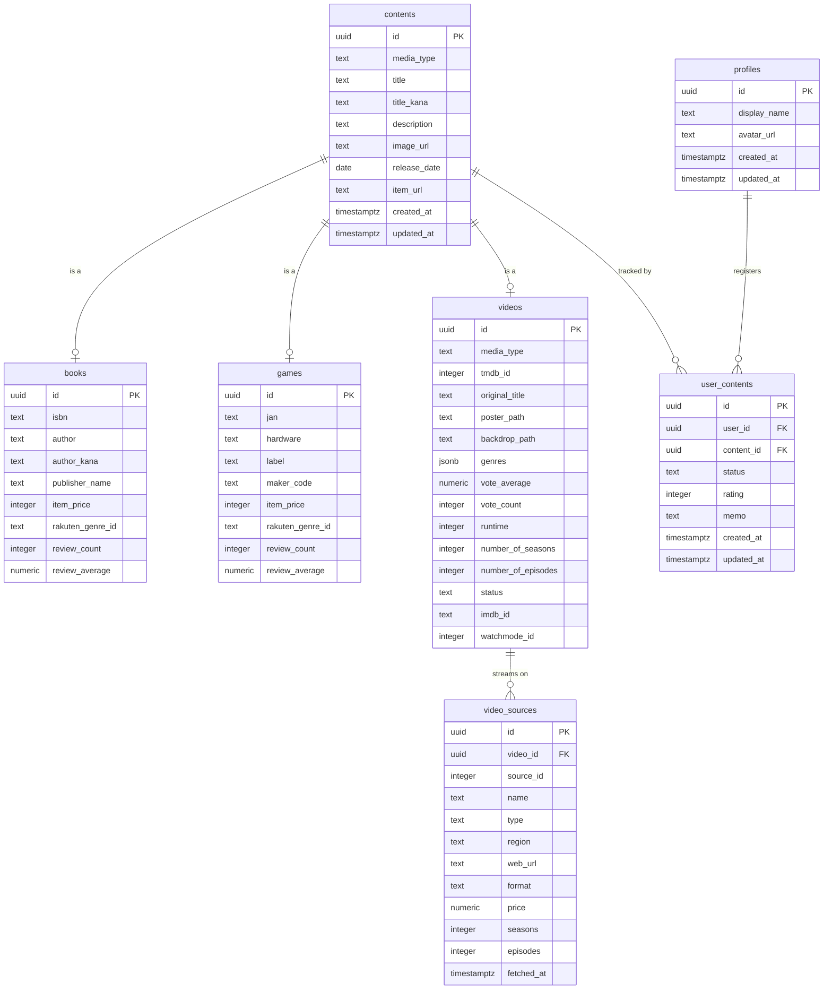

# Contents Hub ER 図

## テーブル一覧

| テーブル名       | 説明                                         |
| ---------------- | -------------------------------------------- |
| `profiles`       | ユーザープロファイル（auth.users と 1:1）     |
| `contents`       | コンテンツ共通テーブル（全メディア横断）      |
| `books`          | 書籍固有情報（楽天ブックス書籍検索 API 対応） |
| `games`          | ゲーム固有情報（楽天ブックスゲーム検索 API 対応） |
| `videos`         | 映像作品固有情報（TMDB API 対応）             |
| `video_sources`  | 映像作品の配信情報（Watchmode API 対応）      |
| `user_contents`  | ユーザーとコンテンツの関連                    |

## リレーション

- **contents ↔ books / games / videos（スーパータイプ・サブタイプ）**: 同じ `id` を共有する 1:1 関係。`contents` に共通情報、サブタイプテーブルにメディア固有情報を持つ。1 つの `contents` に対してサブタイプは 1 つだけ存在する（`media_type` で判別）
- **profiles ↔ user_contents ↔ contents（多対多）**: ユーザーがコンテンツを登録すると `user_contents` に行が作られる。ステータス・評価・メモはユーザーごとの個人データ
- **videos ↔ video_sources（1 対多）**: 1 つの映像作品に複数の配信ソース（Netflix, Amazon 等）が紐づく

## ER 図

## ステータス管理

`user_contents.status` は以下の 3 値:

| 値     | 意味                                     |
| ------ | ---------------------------------------- |
| `want` | 気になる・未着手                         |
| `doing`| 進行中（読書中・プレイ中・視聴中）       |
| `done` | 完了（読了・クリア・視聴済み）           |

## マイグレーションファイル

`supabase/migrations/20260429073936_create_tables.sql`
